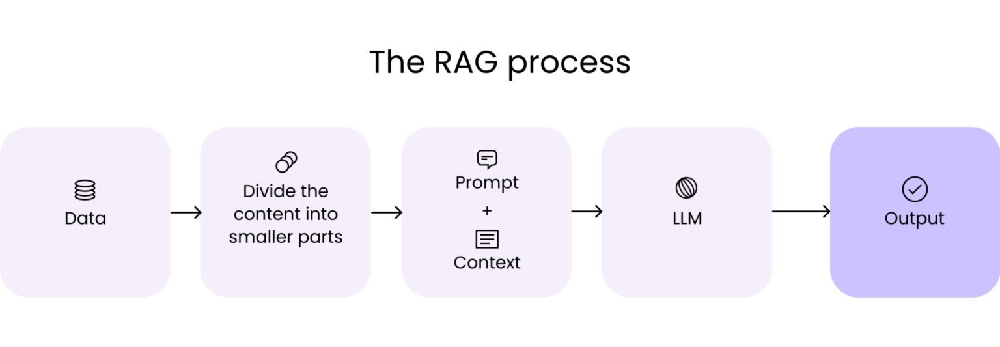

# Implementing a Simple RAG System.

**Practical Example of Adding RAG to an LLM.**

---

### Background
In this project, I demonstrate how to implement a RAG system that answers user's questions about the Kenyan Constitution (2010 version), and Finance Bill 2025, with context retrieved from the knowledge base.

The system must retrieve relevant travel information from collected data sources and generate grounded responses using a Large Language Model (LLM). The model must not rely on its general knowledge but instead answer strictly from retrieved documents.

In the previous article, I gave an overview of a simple RAG system. In this article, I will explain the technical aspects of how RAG works, and provide examples in Python code. 

First, an in-depth, more technical explanation of how RAG works.

### How Does RAG Work?
A simple RAG system connects an LLM to external data sources such as policy documents and company databases, allowing it to answer user questions with relevant, up-to-date information. It works by embedding the reference documents, searching the documents for semantic relevance to the query, then using the retrieved documents to answer the query. 

 *Credit: [Writer's Room](https://writer.com/blog/retrieval-augmented-generation-rag/)* 

